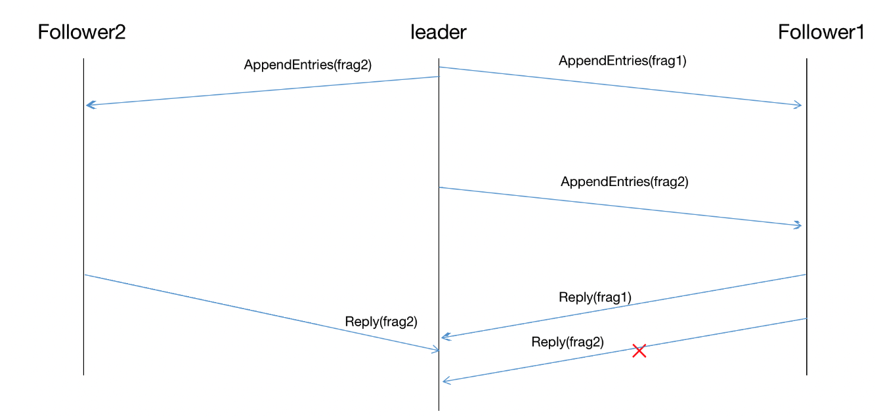

# Overview

Similar to CRaft, FlexibleK is a variant of Raft algorithm that uses erasure coding to reduce network and storage cost. Different from CRaft, FlexibleK uses a **dynamic encoding parameter $k$** (in conjunction with $m$) to achive the best possible storage & network cost reductions. Further more, the dynamic parameter $k$ helps to prevent our algorithm falling back to original raft, which is a main disadvantage of CRaft that causes a sharp performance degration when the number of fail servers reaches some threshold.

## Choose the parameter

Larger $k$ helps reducing more storage & network cost. An RS erasure-coding process with parameter $(k, m)$ on one entry cuts data into $k$  fragments with equal size and generates another $m$ parities using matrix operations. Thus each of the resultant fragments only has $1/k$ size of the original entry, both storage and network cost reductions is $1/k$. 

To achive the best possible storage and network cost reductions, FlexibleK always picks the **largest possible $k$** as the encoding parameter. However, there is an upper bound for $k$: to commit a raft entry, at least $F+k$ different fragments are required to be replicated on different servers,  thus $k$ is at most $N-F$ where $N$ is the number of alive server in current cluster. $N$ can be detected by leader via heartbeat responses and $F$ is determined by the cluster configurations. 

When encoding an entry, the leader **always uses $k=N-F$ as the encoding parameter**. For $m$, we simply set $m=F$ as $k+m$ is the total number of generated fragments and is supposed to be less than or equal to $N$.  Most notably, $m$ has no effect on the commit requirement and cost reductions, thus it could be a freely choosen parameter. Setting $m=F$ means all servers needs to receive a fragment to make this entry to be committed, which might be inpractical due to the existence of slow servers. This leaves some leeway for parameter adjusments: A smaller $m$ can be used to tolerant such slow servers, so that the performance is not degraded. 

---

# Implementation

## Challenges

In FlexibleK, the encoding parameter $k$ changes as servers quit from or rejoin raft cluster. This arises a huge challenge for us to validate the consistent states of raft cluster. In original raft, entry replicated on different servers is uniquely identified by ``(raft_term, raft_index)``, that is:

> Log entry with same raft term and raft index has the same command data

However, in FlexibleK and any erasure-coding based raft variants, this is not necessarily true since repcliated entries are fragments. In FlexibleK, the case is even worse: we can not say that "raft log entry with same raft term and raft index can be decoded into the original log entry" since these fragments may come from different encoding stripes(i.e. Different encoding parameters (k, m)). Moreover, the unpredicated network issues such as out of order message transfer and randomly message drop exacerbate this problem, making the leader hard to track the replication states on each follower, and fail to make a correct decision on commitment. 

### Example1: Network message transfer issues

Consider the follower diagram:



In a raft cluster consists of 3 servers, the leader encodes an entry with parameter $(k=2, m=1)$ and it sends fragment to both follower1 and follower2. In the first round, leader sends fragment1 and 2 to follower1 and 2 respectively and both fragments are stored on these followers. However, the leader may find a timeout of these AppendEntries messages and decides to send a second round of appendEntries, this time, leader send fragment1 to follower2 and fragment2 to follower1. However, The appendEntries RPC to follower2 was lost and the response from follower1 is lost. As a result, fragment2 was replicated on both followers but leader would think that two different fragments has been replicated on these servers, and make a commitment on this entry, which is incorrect.

## Analysis and Solution

This incorrect commitment case occurs due to the reason the leader failed to track the correct status of fragments on each follower. More specifically, the AppendEntries responses message does not necessarily describe a correct states of logs on each follower. In original raft, when an AppendEntries response says that all entries in this message has been appended to follower, it guarantees the log entries carried in this messages must be a prefix array of current log array of that follower, thus the leader can make a correct commit decision. However, in FlexibleK, existed log entries with the same index can be overwritten by incomming messages, the response may describe a stale state when it reaches the leader.

#### Version for uniquely marking fragments

Our solution is to add extra data structures to uniquely mark each fragments and add these structures in RPC requests and reply so that the leader can detect which fragments of some specific encoding configuration have been replicated. The data structure is called ``Version``, it has the following fields: ``k, m, fragmentId``. We construct such a structure based on the following observation:

> (raft_index, raft_term, k, m, fragmentId) uniquely determines a fragment entry

Since raft_index and term are already carried by each raft entry, each version structure only contains encoding related fields: k, m and fragment_id. 

With Verison structure, the leader is able to records fragments replication status on each follower: The follower simply replies each version that has been replicated in its logs on each AppendEntries response. And leader records replicated version of each entry on each follower when AppendEntries Response arrives and decides to commit the entry when it found out $F+k$ different fragments have been replicated.

#### VersionNumber for distinguishing different send round

The version structure provides necessary information for leader to decide replication status on followers, however, network issues still bothers. Consider the situation where a log entry is overwritten after the follower makes an AppendEntries response, the leader may still got stale information about fragments distribution. To prevent such case happening, we must put some constraints on the rules of log entry overwriting. 

We add a version number for each log entry on each AppendEntries call, to add some **serialization constraints** on log entry overwritten operation. To overwrite a log entry on follower, the version number of the entry carried on AppendEntries messages must be newer than the version of that entry stored locally on that follower. 

The version number is generated by leader and consists of two fields: ``term`` indicates the leader's term when sending this message; an monotonically increasing integer ``sequence`` indicates different send round. To compare two version numbers, ``term`` is first compared, the one with higher term is considered to be a newer version; ``sequence`` is compared if ``term`` equals. 

VersionNumber constraints gurantees that a follower will always have the newest verison of entry, which is helpful for leader to track the replication status of each entry. For example, when an AppendEntries response tells the leader that a fragment with version number ${term=1, sequence=1}$ has been replicated on a follower, it means this follower currently stores this entry with version newer than $term=1, sequence=1$. Further more, the leader will records the newest version it broadcasts, if the reply version matches the latest version, the leader asserts this specified fragment has been replicated on some follower and it would check if it's ok to commit this entry.

However, one corner case is that there might be multiple leader at different term. 

#### Commit requirements

Different from Raft, FlexibleK needs to track the commit requirements for each log entry. On each encoding or sending log entry, the leader generates a new version number and each entry carried in AppendEntries RPC share the same version number. The leader records this version number and associated version, i.e. $k$ for commit requirement $F+k$. 

When receiving AppendEntries response, the leader only accepts replied versions that matches the latest broadcast version number. And count these replied versions from different followers to check if $F+k$ different fragments have been replicated on different followers, if so, the leader commits the entry.

## Pseudocode

### Data structure

```cpp
struct VersionNumber {
  uint32_t term;
  uint32_t seq;
}
struct Version {
  VersionNumber v_number;
  int k, m;
  raft_frag_id_t fragment_id;
}
struct LogEntry {
  raft_index_t raft_index;
  raft_term_t raft_term;
  Version version;
  // Data
}
```

### replicate process

```cpp
void replicate_entries() {
  int k, m = calculate_alive_servers();
  auto version_num = NextVersionNum();
  // Step1: Encoding or re-encoding entries:
  for (idx := commit_index + 1; idx <= last_index; ++idx) {
    if (log[idx]->NotEncoded() || log[idx]->GetK() != k || log[idx]->GetM() != m) {
      Encode(log[idx]);
    }
    log[idx]->UpdateVersion(version_num, k, m);
    log[idx]->UpdateCommitRequirements(version_num, k, m);
  }
  // Step2: Construct a map to decide which fragments will each server receive
  auto frag_map = ConstructFragmentToFollowerMap();
  
  // Step3: For each server, send them corresponding fragments
  for (follower : peers) {
    auto fragment_id = frag_map[follower->Id()];
    AppendEntriesArgs args;
    for (entry in [commit_index + 1, last_index]) {
      args.Add(entry->Fragments(fragment_id));
    }
    rpc->SendAppendEntries(follower->Id(), args);
  }
}
```

On replicate entries, the leader will send out all log entries indexed from ``CommitIndex+1`` to ``lastIndex``. This contains three different steps:

1. For each entry within this range, leader encoding these entries based on calculated parameter k and m. If some entries have been encoded by previous replication procedure the leader decides if it's necessary to re-encode them by checking if encoding parameter k and m has changed. Each entry that will be sent within this range will be assigned with a new version number. The leader also records the new version number and associated encoding parameter $(k, m)$ as commit requirements.
2. The leader will construct a map to decide which fragment will be sent to each follower.
3. Leader sends each coded fragment to assigned follower through an RPC call.

### Follower recv AppendEntries

```cpp
void OnReceiveAppendEntries(AppendEntriesArgs args) {
  for (entry in args) {
    if (entry.version < logs[idx].version) {
      continue;
    }
    if (NeedOverwrite) {
      log[idx]->Overwrite(entry);
    } else {
      log[idx]->UpdateVersion(entry.version);
    }
  }
  reply version;
}
```

When receiving AppendEntries request from leader, the follower basically does the same as original raft algorithm. It checks if there is conflict log entry in terms of ``(raft_index, raft_term)`` and append any new log entry. The modified part in FlexibleK is that the follower will do additional version check on log entries that have been replciated locally. Simply speaking, the follower checks if incoming entry should overwrite existed entry, by checking if the tuple $(k, m, fragment\_{id})$ has been changed. If there is no need to overwrite this entry, the follower simply updates the version number of this entry. In the end, the follower replies with replicated version of the entry contained in this arguments.

### On recv AppendEntries Reply and commit an entry

```cpp
void OnReceiveAppendEntriesReply(AppendEntriesReply reply) {
  for ([index, version] in reply.versions) {
    if (peer.stored_versions[index] < version) {
      peer.store_versions[index] = version;
    }
  }
  MaybeUpdateCommitIndex();
}
void MaybeUpdateCommitIndex() {
  for (index = commit_index + 1; index <= last_index; ++index) {
    int agree_cnt = 1;
    for (peer : peers) {
      if (peer.store_version[index].version_num == commit_requirements[index].version_num) {
        agree_cnt += 1;
      }
    }
    if (agree_cnt >= commit_requirements[index].k + F) {
      UpdateCommitIndex(index);
    }
  }
}
```

The leader maintains the replicated version of each entry for each server. On receiving the AppendEntries reply, the leader updates the version at a specific raft index if its version number matches the latest broadcast version number. Then leader checks if it's possible to commit any entry by counting the number of different fragments that have been replicated.