## Implementation

### Challenge1: Varied parameter k

In FlexibleK, a raft log entry can not be uniquely determined by a (index, term) pair. In any erasure-coding based raft variants, the leader sends encoded fragments to followers, which carry different contents on different followers. The fragments replicated on different servers altogether forms up a "full entry". Thus, the leader can not make a commitment by simply tracking the index of replicated entries (i.e MatchIndex in original Raft) , instead, the leader is supposed to track the number of fragments belonging to one encoded stripe as well. 

In FlexibleK, the case is even worse with a varied encoding parameter k. In FlexibleK, the leader may re-encode one uncommited entry when it detects the number of live servers changes and sends these fragments belonging to the new encoded-stripe to followers. This may result in a case that fragments belonging to different encoded stripes coexist in followers, making leader hard to make the commitment. 

#### Example

Here is an example for this anomaly: 

The leader encodes one entry with parameter $k=3, m=2$ and replicates them to followers, however, the follower S4 fails and leader changes its encoding parameter to $k=2, m=2$ for re-encoding and replicates this new stripe to followers. Both S2 and S3 accepts the fragments of new stripe but the message to S1 is lost, resulting in a case where fragments of different stripes coexist in the same raft index of different servers. The leader can not simply commit this entry by counting that $F+k$, i.e. 4 servers have replicated some fragments of this entry, since the actual replicated entries does not come from the same encoded stripe. 

#### Solution

The key point to these anomalies is that the leader lacks enough information for a correct commitment decision. Thus, our solution is to add extra meta information for each raft entry. The meta information is a triple (called **Version**) consists of three fields: k, m and a fragment id where k, m unique determines an encoded stripe of one entry and fragment id is used to help the leader specifying the replication states of one stripe, i.e. distinguish different fragments. To ensure the leader knows exactly the replication states of one entry, different from the original raft where followers only reply an accept flag in AppendEntriesRPC reply, FlexibleK requires followers to reply the Version struct of each of its appended log entries. 

---

### Challenge2: Dealing with message communication issues

A consensus algorithm is supposed to dealing with various kinds of failures. One particular failure is the network packages lost and out-of-order transfer. Though a reliable network protocol like TCP can mostly avoid above issues, we expect our modification to raft is robust to survive network issues. 

The message transfer issues bother in FlexibleK in a sense that package lost and out-of-order transfer may cause followers and leader receiving stale information. For leader, such stale information may cause an incorrect decision on commitment, which is intolerable in terms of the safety for a consensus algorithm.

In FlexibleK, the leader expects the follower always stores the fragments that comes from the leader's latest encoded stripe, and replies to the leader with an associated Version information so that the leader can commit this entry correctly by checking if all collected Version matches the commitment requirement (i.e. at least $F+k$ different fragments have been replicated on different servers). However, with network failures, the leader may receive responses that carry stale information about the replicatition states on that follower and makes an incorrect commitment. 

#### Example

In the above example, the leader sends two stripes with different encoding parameters to followers due to a detection that S4 fails. However, the messages carrying fragment3 of two stripes incur an out-of-order failure, which causes the fragment of latest encoded stripe is overwritten by its counterpart in the early stripe. The leader would consider all fragments of the latest stripe have been replciated on followers when it receives the response from the later RPC call and thus commit this entry despite it should not.

#### Solution

The key point to the above issue is that the follower has no idea which incoming message represents the latest encoded stripes from leader. The followers just simply overwrite log entries with the same raft index and term in the order the messages arrives, instead of the order the entry is encoded in leader side.

To address this issue, **we introduce a concept of VersionNumber to enforce the follower overwriting fragments in a leader-specified order**, i.e. The follower is allowed to overwrite the fragments only when it receives the fragments of newer VersionNumber. The VersionNumber consists of two fields: ``term`` indicates the leader's current term (distinguish from the term this entry is proposed); ``sequence`` is a monotonically increasing number similar to the sequence number used in TCP protocol to distinguish fragments of latest stripe and stripe encoded earlier. On each re-encoding of one entry, the sequence number is incremented and is attached to every fragments in the stripe, so that the follower can distinguish a newer stripe by simply comparing VersionNumber of incomming fragments and VersionNumber of fragments it has replicated before.

VersionNumber provides a total order relationship on all encoded stripes of one single entry. To compare two VersionNumber, say ``v1`` and ``v2``, their term is compared first, the one with higher term is considered to be newer(or namely, larger), if their term is equal, then it indicates these fragments marked by this VersionNumber comes from the same leader(According to raft, there is at most one leader in a given term), the higher ``sequence`` value shows a higher VersionNumber. 

With Version and VersionNumber, the leader can correctly tracks the replication states of an encoded stripe. The monotonically-increasing VersionNumber overwritten rule gurantees that: when the leader receives a response that says a fragment with Version ``v1`` has been replicated on some follower, the actual Version ``v`` stored on that follower must satisfy: ``v >= v1``. However, since current leader is the only one that generates increasing VersionNumber, if the leader has not reencoded any newer stripe, it can assert that the fragment stored on that follower has exactly version of ``v1``. Together with associated Version struct, the leader builds a complete view of the distribution states of this stripe. 

#### Discussion

One corner case of above solution is that there might be two or more leaders of different term, sending fragments to the same follower, resulting in at least one ApppendEntries RPC response carries stale information, which conflicts our assertion above. However, we show that this condition does not affect the safety of FlexibleK. 

Consider the following case: a leader (say $L1$) sends a fragment with VersionNumber $(term=1, seq=1)$ to a follower (say $F1$) and the follower accepts this fragment, replies with exactly the same VersionNumber $(term=1, seq=1)$. Then a leader with higher term (say $L2$ ) send a newer version to this follower, with higher VersionNumber $(term=2, seq=1)$. According to our overwritten rule, the fragment will be overwritten on $F1$. However, the response made by $F1$ earlier to $L1$ carries a stale information, we must verify that $L1$ will not commit this entry. 

The verification is simple: Since $L2$ has higher term of 2, there are at least $F$ followers of term greater than or equal to 2, denoting these followers as set $S$. Since $L1$ needs to contact at least $F$ followers to commit one entry, there is at least one is among $S$. As a result, before $L1$ commit this entry, it will receive a response from some server in $S$, which indicates a higher term. $L1$ will falls back to be a follower and gives up commiting this entry.

